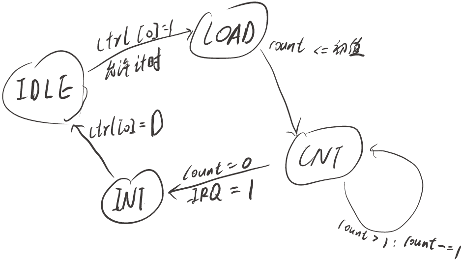
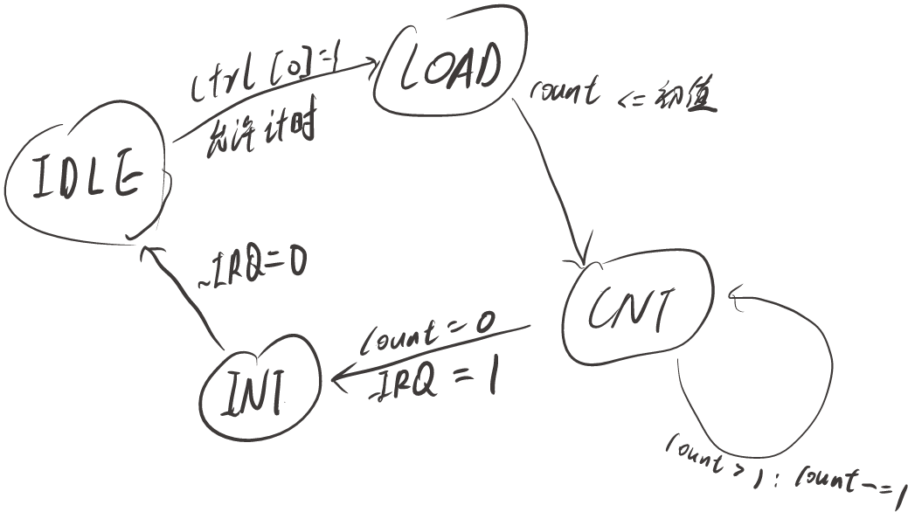

# 模块

## 顶层模块

### mips

- 构建整个 CPU，实现流水线
- 输出必要信息

## datapath

### IM

- 指令存储器

- 输入

  - `clk`
  - `reset`
  - `block` 阻塞信号
  - `[31:0] nPC`

- 输出

	- `[31:0] Instr`

	- `reg [31:0] PC`

- 地址范围 `0x3000~0x6FFF`

- 读入 `code.txt` 

- 同步复位

### PC_Calc

- 计算下一条指令地址
- 输入
	- `[31:0] PC`
	- `[25:0] instr_index`
	- `[15:0] offset`
	- `Beq`
	- `[31:0] RegData`
	- `[1:0] IMControl`
	- `eret` 异常返回
	- `Req` 进入中断处理程序
	- `[31:0] EPCOut` EPC 的值
- 输出
	- `[31:0] nPC`
	- `[4:0] ExcCodeOut`
	
-  对应跳转

	| IMControl |    操作    |
	| :-------: | :--------: |
	|   IM_4    |    PC+4    |
	|   IM_j    | 跳转偏移量 |
	|   IM_jr   | 跳转寄存器 |
	|  IM_Beq   |    分支    |

### GRF

- 寄存器堆
- 输入
	- `clk`
	- `reset`
	- `[4:0] RA1`
	- `[4:0] RA2`
	- `RegWrite`
	- `[4:0] WA`
	- `[31:0] WD`
- 输出
	- `[31:0] RD1`
	- `[31:0] RD2`
- `$0` 寄存器永远为 0
- 同步复位
- 内部转发

### ALU

- 计算单元

- 输入

  - `[31:0] D1`
  - `[31:0] D2`
  - `[15:0] Imm`
  - `[5:0] ALUop`
  - `ALUSrc`
  - `Ext`
  - `[3:0] Instr_type` 指令类型
  - `[4:0] ExcCodeIn`

- 输出

  - `[31:0] out`

  - `[4:0] ExcCodeOut` 异常代码

  	| Instr_type && Behavior |   ExcCode   |
  	| :--------------------: | :---------: |
  	|   type_Load && 溢出    | AdEL : 5'd4 |
  	|   type_Store && 溢出   | AdES : 5'd5 |
  	|   type_CalOv && 溢出   | Ov : 5'd12  |
  	|        defaule         |    5'd0     |

- 功能

	|  ALUop  |
	| :-----: |
	| ALU_add |
	| ALU_sub |
	| ALU_or  |
	| ALU_sll |
	| ALU_lui |

### Mux

- 多路选择器

### Bridge

- 系统桥

- 输入

  - `[31:0] Addr` 输入地址
  - `[31:0] WriteData` 写入数据
  - `[4:0] ExcCodeIn` BE 模块异常代码
  - `[3:0] Op` 操作类型
  - `[31:0] m_data_rdata` 数据存储器读出数据
  - `[31:0] Dout_T0` 计时器 T0 寄存器值
  - `[31:0] Dout_T1` 计时器 T1 寄存器值

- 输出

  - `[31:0] ReadData` 读出数据
  - `[31:0] m_data_addr`  数据存储器地址
  - `[31:0] m_data_wdata` 数据存储器写入数据
  - `[3:0] m_data_byteen` 数据存储器字节使能信号 
  - `[31:2] Addr_T0` 计时器 T0 地址
  - `WE_T0` 计时器 T0 写入使能信号
  - `[31:0] Din_T0` 计时器 T0 写入数据
  - `[31:2] Addr_T1` 计时器 T1 地址
  - `WE_T1` 计时器 T1 写入使能信号
  - `[31:0] Din_T1` 计时器 T1 写入数据
  - `[31:0] m_int_addr` 中断发生器待写入地址
  - `[3:0] m_int_byteen` 中断发生器字节使能信号
  - `[4:0] ExcCodeOut` 异常代码

- `[2:0] devide` 设备编号

	|            Addr            |         device          |
	| :------------------------: | :---------------------: |
	| [0x0000_0000, 0x0000_2FFF] |    device_DM : 3'd1     |
	| [0x0000_7F00, 0x00007F0B]  |    device_T0 : 3'd2     |
	| [0x0000_7F10, 0x00007F1B]  |    device_T1 : 3'd3     |
	| [0x0000_7F20, 0x0000_7F23] | device_interrupt : 3'd4 |
	|          default           | device_undefine : 3'd0  |

	

## Controller

### CP0

- 协处理器
- 输入
	- `clk`
	- `reset`
	- `en` 寄存器写使能信号
	- `[4:0] Addr` 寄存器地址
	- `[31:0] CP0In` CP0 写入数据
	- `[31:0] VPC` 受害 PC
	- `BDIn` 是否为延迟槽指令
	- `[4:0] ExcCodeIn` 异常类型
	- `[5:0] HWIn` 输入中断信号
	- `EXLClr` 复位 EXL
- 输出
  - `[31:0] CP0Out` CP0 读出数据
  - `[31:0] EPCOut` EPC 的值
  - `Req` 进入处理程序请求

### Hazard_Controller

- 冒险控制器
- 输入

  - `clk`
  - `reset`
  - `[4:0] rs_Addr`
  - `[1:0] rs_T_use`
  - `[4:0] rt_Addr`
  - `[1:0] rt_T_use`
  - `[4:0] E_RegWA`
  - `[1:0] E_T_new`
  - `[4:0] M_RegWA`
  - `[1:0] M_T_new`
- 输出

  - `block`
  - `[1:0] D_D1_Sel`
  - `[1:0] D_D2_Sel`
  - `[1:0] E_D1_Sel`
  - `[1:0] E_D2_Sel`
- 

### Controller

- 集中式控制器

- 输入

  - `[31:0] instr`
  - `[4:0] ExcCodeIn`

- 输出

	- `[2:0] IMControl`

	  |                        instr / Class                         |    IMcontrol    |
	  | :----------------------------------------------------------: | :-------------: |
	  | Cal_rr, Cal_ri, Mv_fr, Mv_to, Load, Store, Mul_div, Lui, mfc0, mtc0, syscall |  IM_4 : 3'b000  |
	  |                            Jal, J                            |  IM_j : 3'b001  |
	  |                           Jalr, Jr                           | IM_jr : 3'b010  |
	  |                             beq                              | IM_beq : 3'b011 |
	  |                             bne                              | IM_bne : 3'b100 |
	  |                           default                            |     3'b000      |

	  

	- `[1:0] WA_Sel` 写入数据地址选择信号

	  |          Class          |      WA_sel       |
	  | :---------------------: | :---------------: |
	  |   Cal_rr, Mv_fr, Jalr   | WA_Sel_rd : 2'b00 |
	  | Cal_ri, Load, Lui, mfc0 | WA_Sel_rt : 2'b01 |
	  |           Jal           | WA_Sel_ra : 2'b10 |
	  |         default         |       2'b00       |

	- `[1:0] ALUData_Sel`

	  |          instr / Class           |       ALUData_Sel       |
	  | :------------------------------: | :---------------------: |
	  | Cal_rr, Cal_ri, Load, Store, Lui | ALUData_Sel_out : 2'b00 |
	  |            Jal, Jalr             | ALUData_Sel_pc : 2'b01  |
	  |               mflo               | ALUData_Sel_lo : 2'b10  |
	  |               mfhi               | ALUData_Sel_hi : 2'b11  |

	  

	- `ALUSrc`

	  |        Class        | ALUSrc |
	  | :-----------------: | :----: |
	  | Cal_ri, Load, Store |   1    |
	  |       default       |   0    |

	  

	- `Ext`

	  |      instr / Class       | Ext  |
	  | :----------------------: | :--: |
	  | addi, addiu, Load, Store |  1   |
	  |         default          |  0   |
	
	  
	
	- `[5:0] ALUop` 
	
	  | instr / Class |  ALUop   |
	  | :-----------: | :------: |
	  |    Cal_rr     |  funct   |
	  |     addi      | ALU_addu |
	  |     addiu     | ALU_addu |
	  |     andi      | ALU_and  |
	  |      ori      |  ALU_or  |
	  |  Load, Store  | ALU_addu |
	  |      Lui      | ALU_lui  |
	  |    default    |   6'b0   |
	
	  
	
	- `[3:0] BEop`
	
	  |  instr  |       BEop        |
	  | :-----: | :---------------: |
	  |   lw    |   BE_lw : 4'd1    |
	  |   lb    |   BE_lb : 4'd2    |
	  |   lbu   |   BE_lbu : 4'd3   |
	  |   lh    |   BE_lh : 4'd4    |
	  |   lhu   |   BE_lhu : 4'd5   |
	  |   sw    |   BE_sw : 4'd6    |
	  |   sb    |   BE_sb : 4'd7    |
	  |   sh    |   BE_sh : 4'd8    |
	  | default | BE_default : 4'd0 |
	
	- `[2:0] MDop`
	
	  | instr |       MDop        |
	  | :---: | :---------------: |
	  | mfhi  | MD_mfhi : 3'b000  |
	  | mflo  | MD_mflo : 3'b001  |
	  | mthi  | MD_mthi : 3'b010  |
	  | mtlo  | MD_mtlo : 3'b011  |
	  | mult  | MD_mult : 3'b100  |
	  | multu | MD_multu : 3'b101 |
	  |  div  |  MD_div : 3'b110  |
	  | divu  | MD_divu : 3'b111  |
	
	- `[1:0] RegData_Sel`
	
	  |          Instr / Class           |       RegData_Sel       |
	  | :------------------------------: | :---------------------: |
	  | Cal_rr, Cal_ri, Mv_fr, Jal, Jalr | RegData_Sel_out : 2'b00 |
	  |               Load               | RegData_Sel_mem : 2'b01 |
	  |               mfc0               | RegData_Sel_cp0 : 2'b10 |
	  |             default              |          2'b00          |
	
	- `RegWrite`
	
	  |                       Class                        | RegWrite |
	  | :------------------------------------------------: | :------: |
	  | Cal_rr, Cal_ri , Mv_fr, Load, Lui, Jal, Jalr, mfc0 |    1     |
	  |                      default                       |    0     |
	  
	- `start`
	
	  |  Class  | start |
	  | :-----: | :---: |
	  | Mul_div |   1   |
	  | default |   0   |
	
	
	
	- `[4:0] rs_Addr`
	- `[4:0] rt_Addr`
	- `[2:0] T_new` 
	
		|         Class         | T_new |
		| :-------------------: | :---: |
		| Cal_rr, Cal_ri, Mv_fr |   2   |
		|      Load, mfc0       |   3   |
		|          Lui          |   1   |
		|       Jal, Jalr       |   1   |
		|        default        |   0   |
	
	- `[2:0] rs_T_use`
	
		|                    Class                    | rs_T_use |
		| :-----------------------------------------: | :------: |
		| Cal_rr, Cal_ri, Mv_to, Load, Store, Mul_div |    1     |
		|               Br_r2, Jr, Jalr               |    0     |
		|                   default                   |    5     |
	
	
	
	- `[2:0] rt_T_use`
	
		|      Class      | rt_T_use |
		| :-------------: | :------: |
		| Cal_rr, Mul_div |    1     |
		|      Br_r2      |    0     |
		|   Store, mtc0   |    2     |
		|     default     |    5     |
	
	
	
	- `CP0Write` CP0 写入使能信号
	
		|  Instr  | CP0Write |
		| :-----: | :------: |
		|  mtc0   |    1     |
		| default |    0     |
	
	- `[3:0] Instr_type` 指令类型
	
	  | Instr / Class  |     Instr_type      |
	  | :------------: | :-----------------: |
	  |      Load      |  type_Load : 4'd1   |
	  |     Store      |  type_Store : 4'd2  |
	  | add, sub, addi |   type_Cal : 4'd3   |
	  |      Lui       |   type_Lui : 4'd4   |
	  |   Jal, Jalr    |  type_Link : 4'd5   |
	  |  Mv_fr, Mv_to  |   type_MD : 4'd6    |
	  |      mfc0      |  type_Mfc0 : 4'd7   |
	  |    default     | type_default : 4'd0 |
	
	- `[4:0] ExcCodeOut` 异常类型
	
	  |     Behavior      |   ExcCodeOut   |
	  | :---------------: | :------------: |
	  | ExcCodeIn != 5'd0 |   ExcCodeIn    |
	  |     系统调用      | syscall : 5'd8 |
	  |     未知指令      |   RI : 5'd10   |
	  |      default      |      5'd0      |
	
	- `eret` 异常返回
	
	- `BD` 延迟槽
	
	  |             Class              |  BD  |
	  | :----------------------------: | :--: |
	  | Br_r1, Br_r2, Jal, J, Jalr, Jr |  1   |
	  |            default             |  0   |
	
	  

# 思考题

1. > 请查阅相关资料，说明鼠标和键盘的输入信号是如何被 CPU 知晓的？

	产生中断信号，通过中断请求的方式进行交互

2. > 请思考为什么我们的 CPU 处理中断异常必须是已经指定好的地址？如果你的 CPU 支持用户自定义入口地址，即处理中断异常的程序由用户提供，其还能提供我们所希望的功能吗？如果可以，请说明这样可能会出现什么问题？否则举例说明。（假设用户提供的中断处理程序合法）

	中断或异常发生时能直接跳转至该地址。可以，但是当reset后在未指定入口时必须要有一个提前指定好的地址。

3. >为何与外设通信需要 Bridge?

	外设很多，CPU为每个外设都实现一个命令过于繁琐且不利于修改、添加、删除外设

4. > 请阅读官方提供的定时器源代码，阐述两种中断模式的异同，并针对每一种模式绘制状态移图。

	1. 计时器为 0 时保持 0 且持续输出中断信号

		

	2. 计时器为 0 时重置初值且只输出一周期中断信号

		

5. > 倘若中断信号流入的时候，在检测宏观 PC 的一级如果是一条空泡（你的 CPU 该级所有信息均为空）指令，此时会发生什么问题？在此例基础上请思考：在 P7 中，清空流水线产生的空泡指令应该保留原指令的哪些信息？

	返回地址错误，保留 PC , BD 信息

6. > 为什么 `jalr` 指令为什么不能写成 `jalr $31, $31`？

	当在其延迟槽指令产生中断或异常时不能精确异常

7. 

